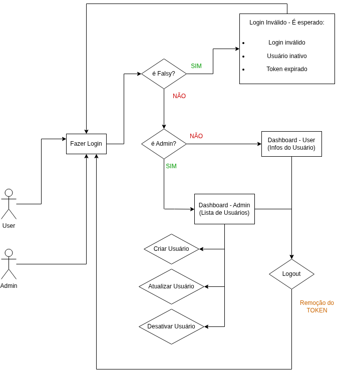
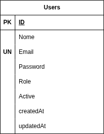
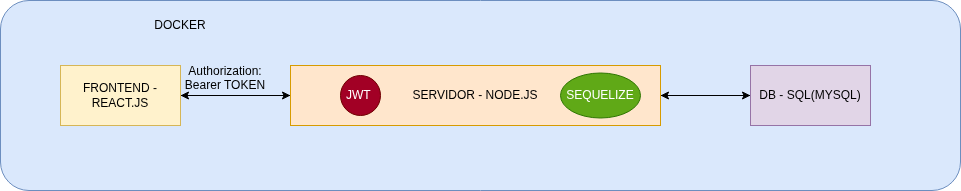

# Sistema de Gestão de Usuários e Acessos (Admin Dashboard)

Gestão simples de usuários, onde os usuários podem ver os dados com permissão limitada e o gestor tem total controle dos dados tendo acesso ao CRUD completo!

Essa aplicação é fullstack, com autenticação, validação de dados, tratamento de erros, tipada para garantir uma segurança para futuras versões, conteinerizada para rodar em qualquer ambiente. No Backend temos um CRUD completo para servir o Frontend, tendo a validação correta das permissões de cada usuário. No Frontend utilizamos de componentes reutilizáveis para melhor flexibilidade e escalabilidade.

Esse projeto tem as seguintes stacks separadas por aplicação:

- Backend
  - Node.js
  - Express
  - TypeScript
  - Sequelize
  - SQL(MYSQL)
  - JWT
  - Docker (FRONTEND + API + DB)

- Frontend:
  - React
  - TypeScript
  - HTML / CSS
  - Fetch

O objetivo principal do projeto é o pleno funcionamento de seus requisitos, em sua primeira versão não contemplará assuntos como:

- Testes automatizados (opcional depois)
- Microserviços
- Clean Architecture hardcore
- CQRS
- Mensageria
- UI perfeita

**Obs: Em versões futuras poderá ser discutido a melhoria da aplicação com os assuntos citados acima**

## Diagramas

Contamos com 3 diagramas essenciais, para facilitarmos o entendimento de algumas partes, optamos por poucos diagramas justamente para não ficarmos preso a isso

### Diagrama de Fluxo

### Diagrama ER

### Diagrama arquitetural

